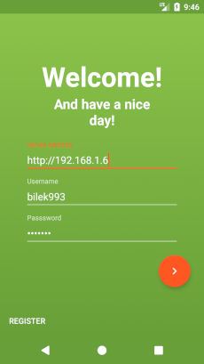
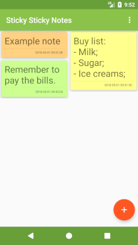
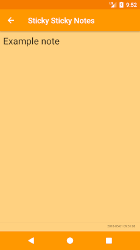

Sticky Sticky Notes
==================================

**Sticky Sticky Notes** is project, that aims to help users store their notes on their own server archtecture. Notes can be stored on ASP.NET server. Mobile application was created using Java and server was created using C# language.

This is android project for **Sticky Sticky Notes**.

## Requirements

* Device with Android OS 5.0+
* Android Studio
* Android SDK version 26 and build tools

## Source code

You can also download latest version of source code using git. To do that enter bellow commands in your terminal:
> git clone https://github.com/bilek993/Sticky-Sticky-Notes---Android.git

or

> git clone git@github.com:bilek993/Sticky-Sticky-Notes---Android.git

## License

This game is licensed under [GPL-3.0](LICENSE). More information can be found [here](https://www.gnu.org/licenses/gpl-3.0.en.html).

## Author

This application is developed by Jakub Biliński. You can find out more about me on my website: [jbilinski.pl](http:/www.jbilinski.pl).